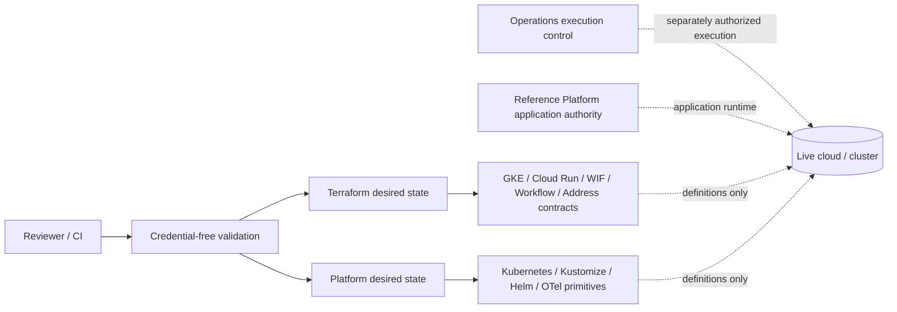

# Architecture

Edge Evidence Infrastructure is a desired-state product with a deliberately separate execution boundary. Its job is to make infrastructure contracts portable, reviewable, and testable; a separately governed Operations layer decides whether and how any live environment is inspected or changed.

## System view



The dashed desired-state edges are intentionally non-executing. This repository describes provider/platform state and proves its shape offline; it does not authenticate to or mutate the live cloud/cluster.

## Desired-state layers

### 1. Reusable Terraform modules

**GKE Autopilot — `terraform/modules/gke-autopilot-cluster`**

One `google_container_cluster` with Autopilot enabled, deletion protection enabled, Terraform `prevent_destroy`, and caller-controlled network/subnetwork/release channel. Existing project/network prerequisites stay external.

**Cloud Run — `terraform/modules/cloud-run-service`**

One `google_cloud_run_v2_service` with immutable digest validation, internal-only ingress by default, deletion protection, bounded scaling/resources, startup/liveness probes, and non-secret environment input. IAM, service accounts, APIs, networking, DNS/TLS and public principals are excluded.

**Private Cloud Run Workflow — `terraform/modules/private-cloud-run-workflow`**

One workflow service account, one Google Workflow resource, and bounded `roles/run.invoker` bindings to explicit Cloud Run service identities. Workflow source is required because it is part of the provider resource, but Infrastructure does not own runtime procedure or application behavior.

### 2. Synthetic / standalone Terraform environments

- `terraform/environments/gke-autopilot` composes the GKE module with externally supplied backend/deployment coordinates.
- `terraform/environments/cloud-run-service-example` demonstrates one generic Cloud Run service without a remote backend.
- `terraform/environments/gke-exposure-address` models one guarded global external IPv4 resource.
- `terraform/environments/github-ops-wif` models GitHub OIDC → Google WIF **provisioning** desired state.
- `terraform/environments/private-cloud-run-workflow-example` demonstrates the private-workflow module with inert synthetic workflow source.

These roots are designed for review and mocked tests. They are not evidence that this repository currently provisions a live environment.

### 3. Generic platform state

`platform/kubernetes/` contains the smallest reusable Kubernetes primitives: namespace state and a generic NEG annotation patch.

`kustomize/` composes network-policy, Istio mTLS/namespace injection, OpenTelemetry collector state, and an observability overlay without retaining application Deployments, Services, or Ingress routes.

`helm-chart/edge-evidence-platform/` retains platform-only Istio and OpenTelemetry rendering with small feature gates.

`observability/otel-collector-config.yaml` is standalone collector configuration used by retained platform plumbing.

## Authority model

Infrastructure answers **what provider/platform state should exist**.

Operations answers **which reviewed actor may execute or inspect live state, under which procedure and evidence requirements**.

The Reference Platform owns concrete application runtime behavior and existing live application relationships.

That split leads to several explicit boundaries:

- No provider credential or impersonation transport is stored here.
- CI does not request GitHub `id-token: write`.
- Terraform validation uses backend-disabled initialization and mocked provider tests.
- No workflow here performs live Terraform plan/apply/import/destroy/state operations.
- No workflow performs `gcloud`, live `kubectl`, Helm install/upgrade, or Skaffold deployment.
- No application Deployments/Services/Ingress topology is claimed by this repository.

## Backend and state handling

Environment roots that declare GCS backends use empty backend configuration. Bucket/prefix coordinates are supplied only by an independently authorized execution context; they are intentionally absent from repository desired state.

This is a portability and authority boundary, not an incomplete configuration. Reviewers can validate configuration and tests without state access, while Operations retains responsibility for live backend identity and state procedure.

`scripts/backend_contract.py` is a pure parser/comparator for already-observed bucket metadata. It demonstrates the expected backend safety contract—uniform bucket-level access, public-access prevention, versioning, and soft delete—without reading a provider itself.

## WIF provisioning versus WIF consumption

The WIF environment provisions a pool/provider and the minimum reviewed impersonation relationship using caller-supplied repository/workflow/ref/event/visibility coordinates. Project roles are explicit, bounded, and empty by default.

It does **not** consume that trust. Token exchange, GitHub OIDC permission, provider authentication, and live repository-to-cloud execution remain Operations concerns. Keeping provisioning and consumption separate makes the trust graph easier to review and prevents a desired-state repository from becoming its own credentialed executor.

## Static-address pattern versus live ownership

The global-address environment models one `EXTERNAL`/`IPV4` address resource with `prevent_destroy` and an optional desired address. The optional value defaults to `null`.

That resource contract is intentionally distinct from ownership of any current live address. There is no import block, state adoption, promotion procedure, or retained live address identity in this repository.

## Source-derived offline validation

Two source-derived helpers preserve mature validation behavior while removing execution authority:

- `scripts/run_heavy_validation.sh` retains safe Helm/Kustomize rendering and Terraform fmt/backend-disabled init/validate/native-test structure.
- `scripts/check_platform_authority.py` retains fail-closed scan-root, prohibited-pattern, backend/resource, and aggregate failure behavior with destination-owned authority bounds.

Additional deterministic checks preserve the accepted source/provenance accounting and Terraform product inventory.

## Why the design matters

**Portability.** Environment-specific coordinates are parameters or external backend configuration rather than embedded live identities.

**Reviewability.** Each Terraform root has a bounded resource inventory; platform primitives are small and application-independent; the authority model is explicit.

**Least authority.** Provisioning definitions cannot silently become credentialed execution because provider transport, WIF consumption, state control, and cluster mutation are absent and policy-checked.

**Reproducibility.** Locked provider versions, mocked Terraform-native tests, deterministic manifests, structural platform checks, and the offline demo create repeatable evidence from a clean checkout.

## Review path

Start with:

```bash
python scripts/portfolio_demo.py
```

Then use [`EVIDENCE.md`](EVIDENCE.md) for the full validation matrix and [`PROVENANCE.md`](PROVENANCE.md) only when deeper extraction/source history is needed.
